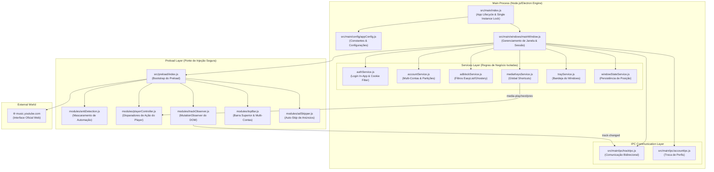

# 🎵 YouTube Music Desktop — Documento de Arquitetura & Projeto

## 📌 Visão Geral

| Propriedade | Especificação |
|:---|:---|
| **Nome do App** | YouTube Music Desktop |
| **Plataforma** | Windows 10/11 (x64) |
| **Framework** | Electron |
| **Padrão Arquitetural** | **Modular Multi-Process Architecture (Domain & Service-Driven)** |
| **Resultado Final** | 📦 **`dist/YouTube Music Setup 1.0.0.exe`** (Instalador Nativo) |
| **Status Geral** | 🟢 **100% Concluído & Compilado** |

---

## 🏛️ Arquitetura Escalável



---

## 📁 Estrutura Final do Projeto

```
e:\Developer\sandbox\Youtube Music\
├── package.json                   # Metadados e scripts (start, dev, build)
├── package-lock.json              # Lockfile
├── PROJETO.md                     # Documento mestre de arquitetura
│
├── src/
│   ├── main/                      # 🖥️ MAIN PROCESS (Backend Desktop)
│   │   ├── index.js               # Entrypoint & ciclo de vida (instância única)
│   │   ├── config/                # ⚙️ Configurações centralizadas
│   │   │   └── appConfig.js
│   │   ├── windows/               # 🪟 Gerenciadores de Janelas
│   │   │   ├── mainWindow.js      # Janela principal
│   │   │   └── splashWindow.js    # Splash Screen frameless
│   │   ├── services/              # 🧩 Serviços de Domínio Isolados
│   │   │   ├── authService.js     # Login in-app com User-Agent inteligente
│   │   │   ├── accountService.js  # Gerenciamento de Multi-Contas / Perfis
│   │   │   ├── adblockService.js  # Bloqueio de anúncios de rede (Ghostery/EasyList)
│   │   │   ├── mediaKeysService.js# Atalhos globais de teclado
│   │   │   ├── trayService.js     # System Tray com ícones brancos
│   │   │   └── windowStateService.js # Persistência de tamanho e posição
│   │   └── ipc/                   # 📡 Handlers IPC
│   │       ├── trackIpc.js        # Eventos de reprodução e título dinâmico
│   │       └── accountIpc.js      # Troca de contas e saída segura
│   │
│   ├── preload/                   # 🌉 PRELOAD SCRIPTS
│   │   ├── index.js               # Entrypoint
│   │   └── modules/
│   │       ├── antiDetection.js   # Mascaramento de webdriver e navigator
│   │       ├── playerController.js# Controle de mídia
│   │       ├── trackObserver.js   # MutationObserver para título e artista
│   │       ├── topBar.js          # Barra superior customizada & modal de contas
│   │       └── adSkipper.js       # Auto-skip de banners e promoções
│   │
│   ├── renderer/                  # 🎨 Telas Nativas
│   │   └── splash/
│   │       ├── splash.html
│   │       └── splash.css
│   │
│   └── assets/                    # 🖼️ Recursos Visuais
│       ├── icon.ico               # Ícone do aplicativo Windows (256x256)
│       ├── icon.png               # Ícone em alta resolução (512x512)
│       ├── tray-icon.png          # Ícone da bandeja
│       └── icons/                 # Ícones brancos do player + botão vermelho
│           ├── play.png, pause.png, next.png, previous.png, stop.png
│           ├── shuffle.png, repeat.png, rewind.png, fast-forward.png
│           ├── volume.png, mute.png, like.png, share.png, equalizer.png
│           ├── avatar.png
│           └── exit.png (Vermelho)
│
└── dist/                          # 📦 BUILD DE PRODUÇÃO
    └── YouTube Music Setup 1.0.0.exe
```

---

# 📊 Roadmap das Etapas — Status Final

| # | Etapa | Status | Descrição |
|:--|:------|:------:|:----------|
| **1** | Setup & Estrutura Modular | ✅ **Concluída** | Base Electron inicializada com arquitetura modular |
| **2** | YouTube Music Oficial & Sessão | ✅ **Concluída** | Interface oficial carregando com partição persistente |
| **3** | Preload & Login In-App | ✅ **Concluída** | Bypass de bloqueio do Google via User-Agent dinâmico por rota |
| **4** | Bloqueador de Anúncios | ✅ **Concluída** | Bloqueador EasyList + Ghostery + Auto-Skipper |
| **5** | Teclas Globais de Teclado | ✅ **Concluída** | Play/Pause/Next/Prev funcionando em segundo plano |
| **6** | System Tray & Splash Screen | ✅ **Concluída** | Bandeja do Windows, ThumbarButtons e tela de carregamento |
| **7** | Persistência de Janela | ✅ **Concluída** | Restauração de tamanho/posição e navegação externa segura |
| **8** | Ícones + Build do Instalador .exe | ✅ **Concluída** | Gerado instalador oficial NSIS em `dist/` |
