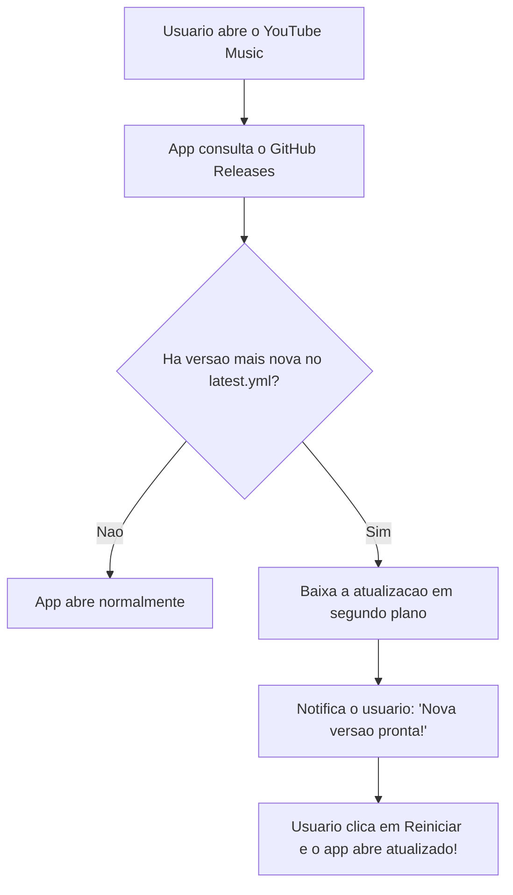
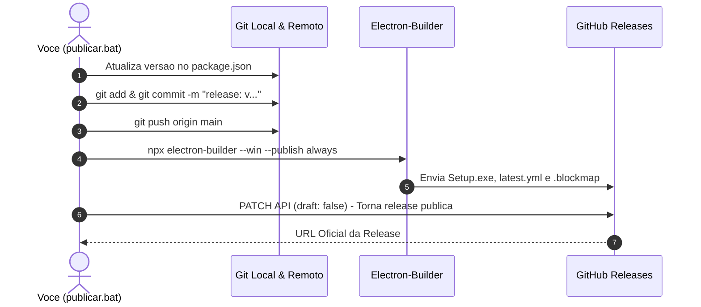

# 🚀 Guia de Publicação & Atualizações Automáticas
### YouTube Music Desktop — Sistema Oficial de Lançamentos

Este guia ensina, de forma prática e passo a passo, como publicar novas versões do aplicativo e como funciona o sistema que atualiza o app de todos os usuários automaticamente pelo GitHub.

---

## 📑 Sumário
1. [Como Publicar uma Nova Versão (Passo a Passo)](#1-como-publicar-uma-nova-versão-passo-a-passo)
2. [Entendendo os Tipos de Versão (SemVer)](#2-entendendo-os-tipos-de-versão-semver)
3. [Como Funciona para os Usuários (Atualização Invisível)](#3-como-funciona-para-os-usuários-atualização-invisível)
4. [O que Acontece nos Bastidores](#4-o-que-acontece-nos-bastidores)
5. [Segurança & Arquivo .env](#5-segurança--arquivo-env)
6. [Dúvidas Frequentes](#6-dúvidas-frequentes)

---

## 1. Como Publicar uma Nova Versão (Passo a Passo)

Sempre que você fizer qualquer alteração no código, corrigir bugs ou adicionar novos recursos e quiser disponibilizar para todos:

### 🔹 Passo 1: Iniciar o Publicador
Você pode iniciar por qualquer um desses caminhos:
* **Pela raiz do projeto:** Dê **dois cliques** no arquivo [`publicar.bat`](../publicar.bat).
* **Pela pasta publish:** Abra a pasta `publish` e dê **dois cliques** em [`publicar.bat`](./publicar.bat).
* **Pelo terminal:** Digite `npm run publish:auto`.

---

### 🔹 Passo 2: O Painel Inteligente Fará a Análise
O script abrirá uma janela no terminal e mostrará:
1. **Versão Local Atual** (lida do `package.json`);
2. **Última Versão no GitHub** (consultada diretamente da API com a data de envio);
3. **Lista de Arquivos Alterados** (mostra em cores quais arquivos você modificou, adicionou ou apagou no projeto).

```text
================================================================================
            YOUTUBE MUSIC DESKTOP - PAINEL INTELIGENTE DE PUBLICACAO           
================================================================================

[1] STATUS ATUAL DO PROJETO:
    * Repositorio GitHub : AllvesMatteus/youtube-music
    * Branch Atual       : main
    * Versao Local Atual : v1.1.0 (package.json)
    * Ultima no GitHub   : v1.1.0 (Publicada em 22/09/2026 22:11)

[2] ARQUIVOS ALTERADOS DETECTADOS NO REPOSITORIO:
    Foram detectadas alteracoes em 3 arquivo(s):
    [MODIFICADO] src/main/windows/mainWindow.js
    [MODIFICADO] src/preload/index.js
```

---

### 🔹 Passo 3: Escolher a Nova Versão
O script calcula automaticamente as próximas versões recomendadas:

```text
[3] DESEJA ALTERAR A VERSAO DO APLICATIVO?
    Versao atual: v1.1.0

    [1] Patch (Correcoes de bugs / Pequenos ajustes) -> v1.1.1 (Recomendado)
    [2] Minor (Novas funcionalidades / Melhorias)    -> v1.2.0
    [3] Major (Grande atualizacao estrutural)        -> v2.0.0
    [4] Manter a mesma versao                        -> v1.1.0
    [5] Digitar uma versao personalizada

Escolha uma opcao [1-5] ou pressione [ENTER] para aceitar a recomendada (v1.1.1):
```
* Basta apertar **`ENTER`** para aceitar a sugestão recomendada (ex: `1.1.1`), ou digitar o número da opção desejada.

---

### 🔹 Passo 4: Digitar as Notas da Versão (Changelog)
O script perguntará o que há de novo nesta versão:
```text
[4] DESCRICAO DAS NOVIDADES (CHANGELOG):
Pressione [ENTER] para usar a mensagem padrao ou digite o resumo das novidades:
```
* Digite um resumo rápido (ex: `Correção nas teclas de atalho e novo mini-player`) ou apenas aperte **`ENTER`** para usar a mensagem automática.

---

### 🔹 Passo 5: Confirmar
O script exibirá o resumo final:
```text
Confirmar e iniciar a publicacao da versao v1.1.1? (S/N):
```
* Digite **`S`** e aperte **`ENTER`**.

---

### 🎉 Pronto! O resto é 100% automático!
O script fará tudo sozinho:
1. Atualizará o `package.json` e o `README.md`;
2. Criará o commit e enviará o código para a branch `main` do GitHub;
3. Compilará o instalador `.exe` de produção;
4. Enviará o instalador e o arquivo de controle `latest.yml` para o **GitHub Releases**;
5. Tornará a release pública para todos baixarem e atualizarem.

---

## 2. Entendendo os Tipos de Versão (SemVer)

O versionamento segue o padrão mundial **SemVer** (`MAJOR.MINOR.PATCH`):

| Tipo | Quando usar? | Exemplo de Mudança |
| :--- | :--- | :--- |
| **Patch** (Opção 1) | Correções de bugs, pequenas melhorias de estabilidade, ajustes visuais pontuais. | `1.1.0` ➔ `1.1.1` |
| **Minor** (Opção 2) | Adição de novos recursos ou páginas (ex: novo mini-player, novas abas, integração Discord). | `1.1.0` ➔ `1.2.0` |
| **Major** (Opção 3) | Reformulação total do aplicativo, mudanças drásticas de arquitetura. | `1.1.0` ➔ `2.0.0` |

---

## 3. Como Funciona para os Usuários (Atualização Invisível)

Você não precisa enviar nenhum arquivo manualmente para os seus amigos ou usuários:



> [!NOTE]
> O módulo `electron-updater` confere o arquivo `latest.yml` no repositório. Como o script sobe o executável + o `latest.yml` com hash de segurança SHA-512, a atualização é 100% segura e à prova de falhas.

---

## 4. O que Acontece nos Bastidores



---

## 5. Segurança & Arquivo .env

> [!IMPORTANT]
> **Onde fica o seu token?**
> Seu GitHub Personal Access Token fica salvo no arquivo `.env` dentro da pasta `publish/` e/ou na raiz.
> 
> **O seu token sobe para o GitHub?**
> **NUNCA!** O arquivo `.env` está explicitamente protegido no arquivo [`.gitignore`](../.gitignore):
> ```gitignore
> # Environment variables
> .env
> .env.local
> .env.*.local
> ```
> Ele permanece exclusivamente no seu computador local. Seus repositórios públicos não expõem sua senha.

---

## 6. Dúvidas Frequentes

#### P: Preciso desinstalar a versão antiga para instalar a nova?
**R:** Não. O instalador gerado substitui os arquivos da versão antiga preservando todas as configurações do usuário (`settings.json`).

#### P: O que acontece se a internet cair durante a publicação?
**R:** O script interrompe a execução com um aviso de erro sem corromper sua release. Basta rodar o `publicar.bat` novamente quando a conexão voltar.

#### P: Como meus amigos recebem o app pela primeira vez?
**R:** Basta mandar para eles o link oficial da Release:  
👉 **https://github.com/AllvesMatteus/youtube-music/releases/latest**  
Lá eles sempre encontram o instalador mais recente (`YouTube-Music-Setup-X.X.X.exe`). Daí em diante, todas as futuras versões atualizam sozinhas!
